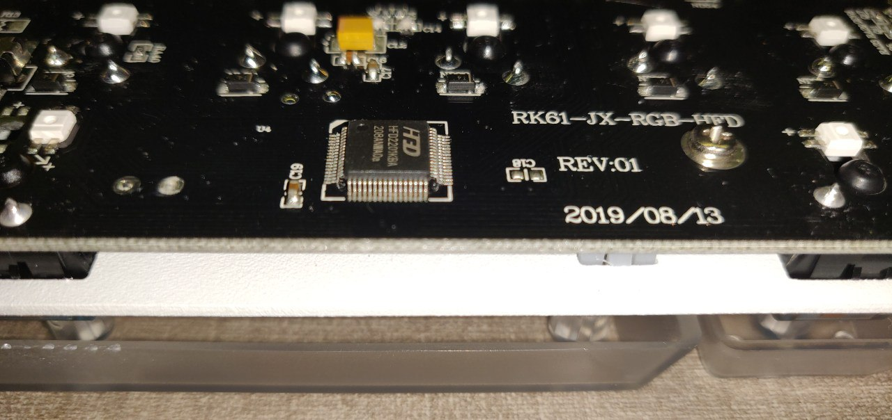
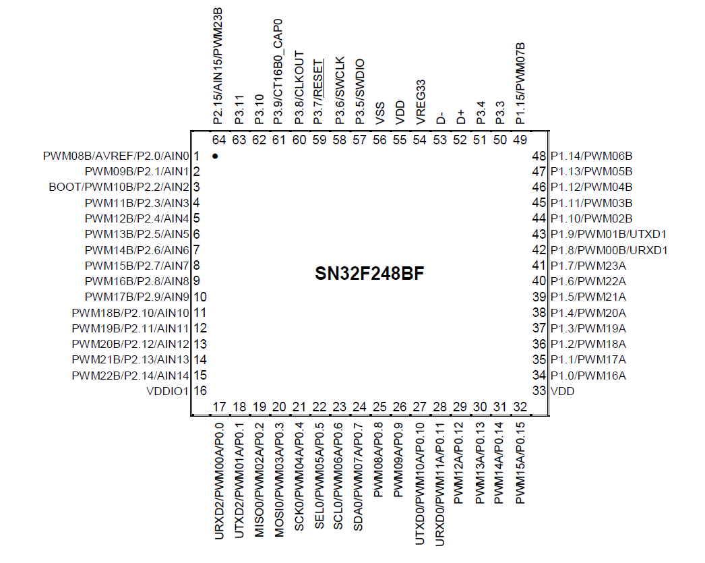

# RK 61 RGB (2019 edition)

Royal Kludge RK61 no hotswap rgb edition, original PID 0x24F.

MCU: HFD2201KBA (rebrand SN32F248BF)

Tested on this board:

Wired only, no bluetooth.

Keyboard Maintainer: [euwbah](https://github.com/euwbah)

Based on Redragon K556 by [Adam Honse](https://github.com/CalcProgrammer1)

For the white-backlit non-rgb version of the RK61, check out [Diff-fusion's repo](https://github.com/Diff-fusion/qmk_firmware)

Make example for this keyboard (after setting up your build environment):

    make royal_kludge/rk61_rgb:default

See the [build environment setup](https://docs.qmk.fm/#/getting_started_build_tools) and the [make instructions](https://docs.qmk.fm/#/getting_started_make_guide) for more information. Brand new to QMK? Start with our [Complete Newbs Guide](https://docs.qmk.fm/#/newbs).

### TODO

- [x] Check if CH_CFG_ST_RESOLUTION should be 32 or 16. Currently 32.
- [x] Confirm MATRIX_COL_PINS, MATRIX_ROW_PINS, LED_MATRIX_COL_PINS, LED_MATRIX_ROW_PINS
- [ ] Make physical positions in g_led_config more accurate
- [ ] Make stuff with OpenRGB SDK

### MCU pins

Uses a HFD2201KBA with 64 pins, a rebrand of SN32F248B.

Diodes go COL2ROW.

Matrix Column scan selector pins:
- RB1: P0.8
- RB2: P0.9
- RB3: P0.10
- RB4: P0.11
- RB5: P0.12
- RB6: P0.13
- RB7: P0.14
- RB8: P0.15
- RB9: P1.0
- RB10: P1.1
- RB11: P1.2
- Col 12 (RB12): P1.3
- Col 13 (RB13): P1.4
- Col 14 (RB14): P1.5

Matrix Row read value pins:
- Row 1: P3.11
- Row 2: P3.10
- Row 3: P3.9
- Row 4: P3.8
- Row 5: P3.7

RGB LED Row selector + color pins:
- Row 1 R: P2.5
- Row 1 G: P2.6
- Row 1 B: P2.4
- Row 2 R: P2.8
- Row 2 G: P2.9
- Row 2 B: P2.7
- Row 3 R: P2.11
- Row 3 G: P2.12
- Row 3 B: P2.10
- Row 4 R: P2.14
- Row 4 G: P1.13
- Row 4 B: P2.13
- Row 5 R: P1.15
- Row 5 G: P1.14
- Row 5 B: P3.3

RGB LED Column power selector:
- Same as matrix column selector pins.
- This is a common pattern for keyboards that use the SN32F248B/HFD2201KBA chip.

### Other notes:

Pins P0.0 to P0.7 appear to go to the bluetooth chip.